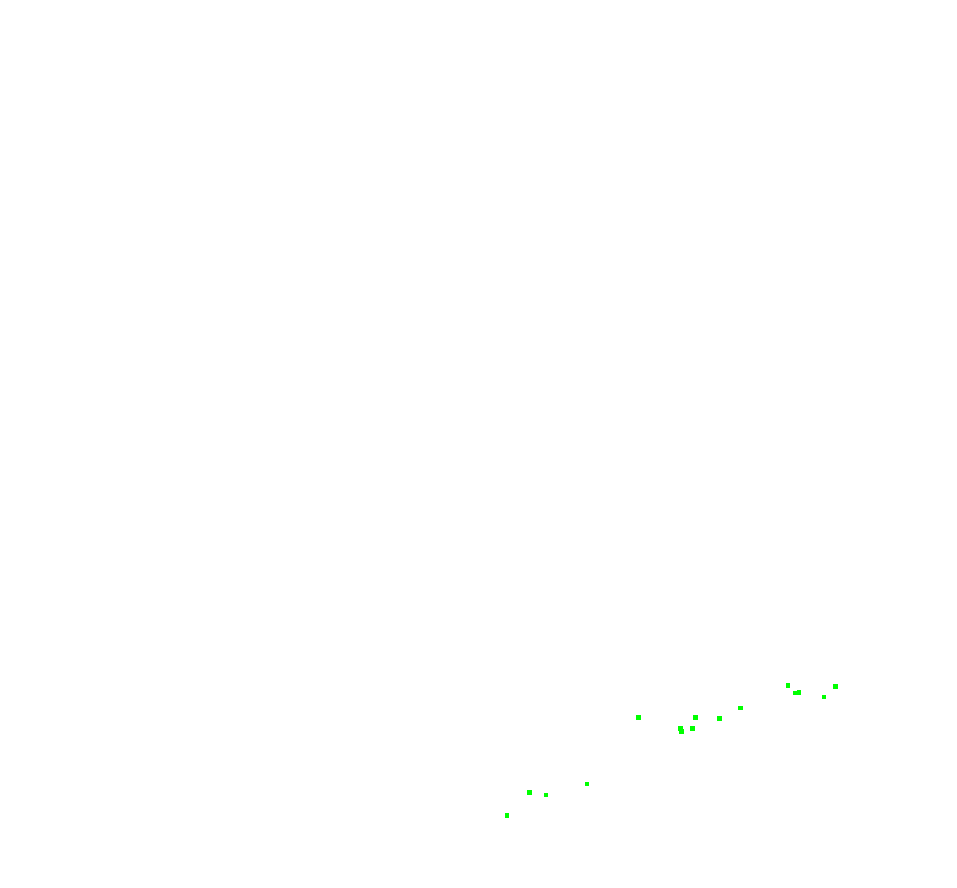

# Problem Statement
We will use BAL dataset from UWash. The data is provided in a text file where the information is stored like this
```
<num_cameras> <num_points> <num_observations>
<camera_index_1> <point_index_1> <x_1> <y_1>
...
<camera_index_num_observations> <point_index_num_observations> <x_num_observations> <y_num_observations>
<camera_1>
...
<camera_num_cameras>
<point_1>
...
<point_num_points>
```
BAL data assumes that the projection plane is behind the optical center of
the camera when projecting, so if we calculate according to the model we used
before, we need to multiply -1 after projection.

# General Workflow
From BAL dataset we get real 3D-2D correspondences of features and camera poses. In our algorithm, we add first normalize the data for numerical stability and then we perturb the states. Now the point cloud is messy, and we have to solve the optimization problem for the optimal 3D-2D correspondences using Ceres or g2o. 

# Results
<table>
  <tr>
      <td align = "center">  </td>
      <td align = "center">  </td>
  </tr>
  <tr>
      <td align = "center">Initial</td>
      <td align = "center">After BA</td>
  </tr>
  </table>
  <table>
  <tr>
      <td align = "center">  </td>
      <td align = "center">  </td>
  </tr>
    <tr>
      <td align = "center">Initial</td>
      <td align = "center">After BA</td>
  </tr>
  </table>